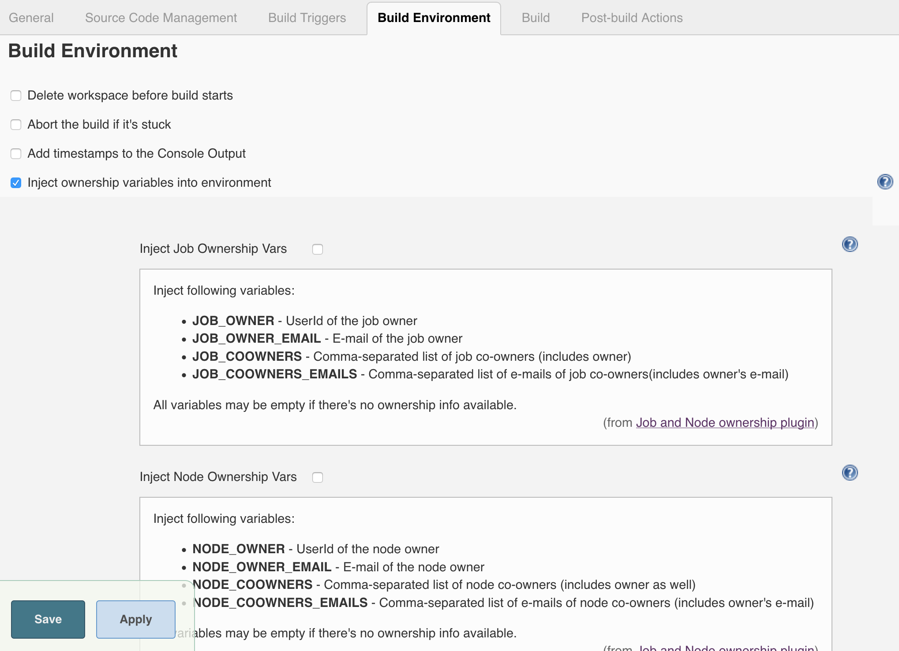
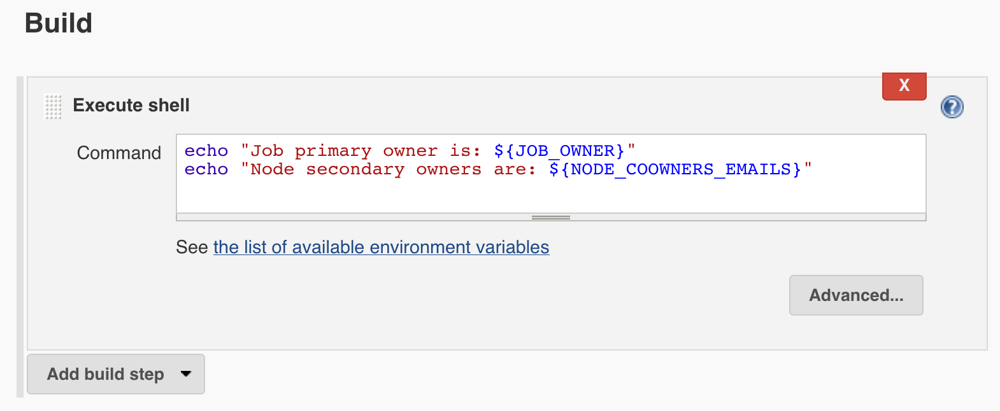
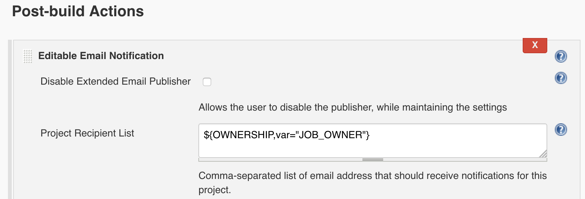

Integration with AbstractProject job types
===

`AbstractProject` is one of the most widely used abstraction layers of Jenkins.
Most of the common job types implement it (Freestyle, Matrix, JobDSL, etc.).

### Environment variables

Ownership plugin may contribute Build Environment variables,
which can be used in custom logic. 
These variables are available from all build steps, including SCM checkout.

Job-specific settings can be configured in the `Build Environment` section of the job configuration.
In [Global Ownership Settings](Configuration.md) it is possible to enable injection of the ownership variables by default.

On the screenshot below you can find the list of injected environment variables:

Usage example:

### Token macro

Particular Jenkins plugins (e.g. Copy Artifact) use [Token Macro](https://plugins.jenkins.io/token-macro) expressions instead of environment variables.
Though all ownership environment variables are accessible through the `${ENV}` macro, there is also a specialized `${OWNERSHIP}` macro.

Usage: `${OWNERSHIP,var="TODO:varname"}`. 
Possible `varname` values and behavior are similar to the Build Environment variables described above.

Usage example:

