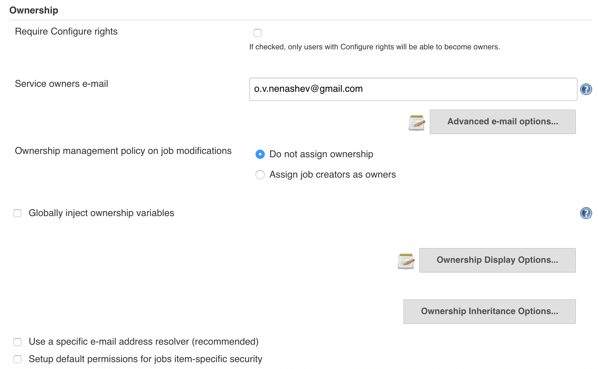
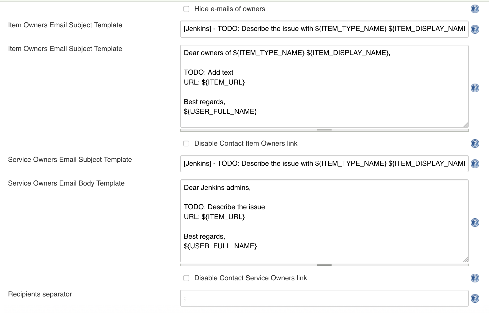
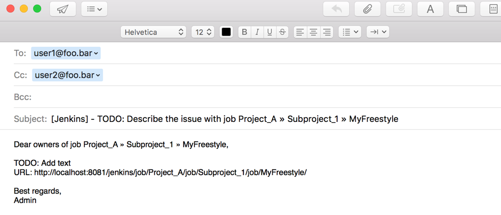
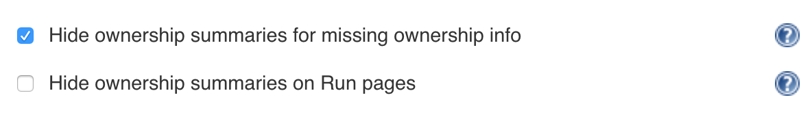

Ownership Plugin Configuration
=====

Ownership plugin can be flexibly configured via global settings.
These settings can be found in _`Manage Jenkins`/ `Configure` / `Ownership section`_.

## Top-level settings

This section defines global settings for the plugin. 
The

Available settings:

* `Require Configure rights` - allows to restrict owner assignment options by the `Item.CONFIGURE` permission. 
If [Ownership-Based Security](OwnershipBasedSecurity.md) is enabled, this control should be unchecked.
* `Service Owners e-mail` - Email of the service owners. 
It will be used for generation of _Contact service owners_ control in the Ownership Summary Box.
* `Ownership Management policy` - This option can be used to automatically set up ownership for newly created and copied items.
 * By default, the ownership won't be set up
 * `Assign job creators as owners` automatically assigns owners (useful for Ownership-Based security)
* `Globally Inject ownership variables` - If enabled, 
ownership variables will be automatically injected to all classic job types (Freestyle, Matrix, etc.).
For Jenkins Pipeline the [`ownership` global variable](PipelineIntegration.md) will be always enabled independently of this setting.
* `Use a specific e-mail address resolver` - If enabled,
the plugin will be using only a limited set of email resolvers to determine the user email.
 * The option may be used to optimize the resolution when plugins with heavy email resolvers are installed (e.g. Subversion or Perforce plugins).
 * `Fast UI resolver` uses built-in routines of the [Mailer plugin](https://plugins.jenkins.io/mailer) => user e-mails will be resolved by user properties and e-mail suffixes
* `Setup default permissions for item-specific security` - If enabled, 
 [Ownership-Based Security](OwnershipBasedSecurity.md) will have a custom default settings when the job owner specifies or resets _Item-specific security_ .

## Advanced e-mail options

This section manages the generation of `mailto:/` hyperlinks in Ownership summary boxes.

You can do the following:
* Enable/Disable visualization of the hyperlinks
* Specify the email subject and body templates using the `${VALUE}` macros. 
Full list of available macros is specified in the built-in documentation.
* Change the default email recipient separator

Below you can find a sample email generated by the plugin:

## Ownership Display options

This section allows to hide Ownership summary boxes in particular cases.
Some additional visualization settings are also available in previous sections (e.g. `Advanced e-mail options` allows hiding email links).

## Ownership Inheritance options

This section contains settings, which allow optimizing ownership inheritance to get a better performance on large-scale instances.

