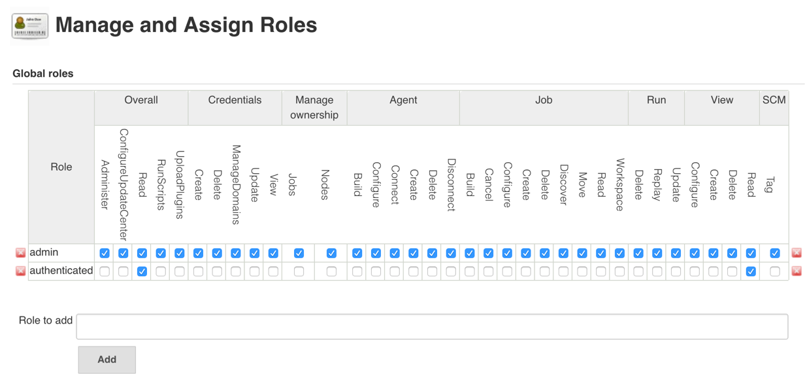
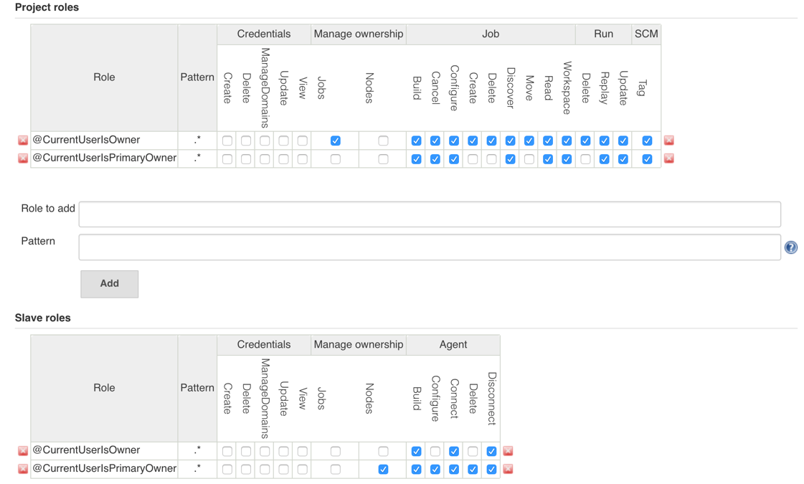
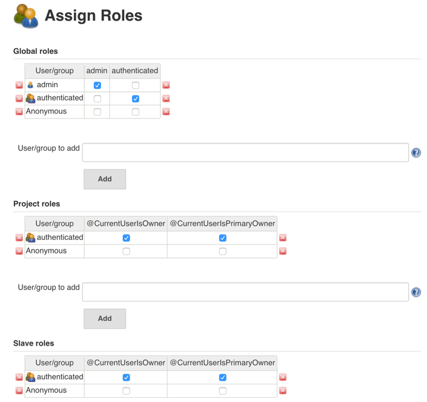
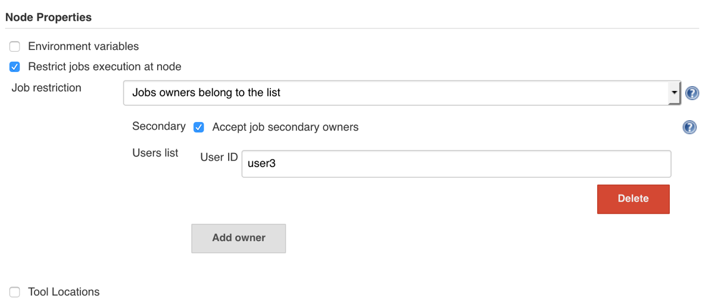
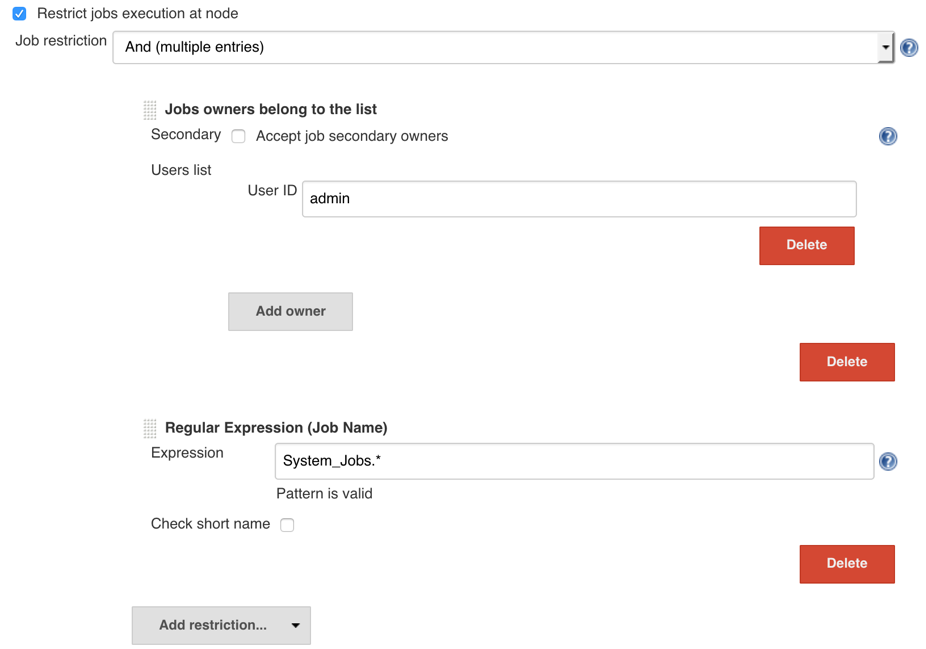
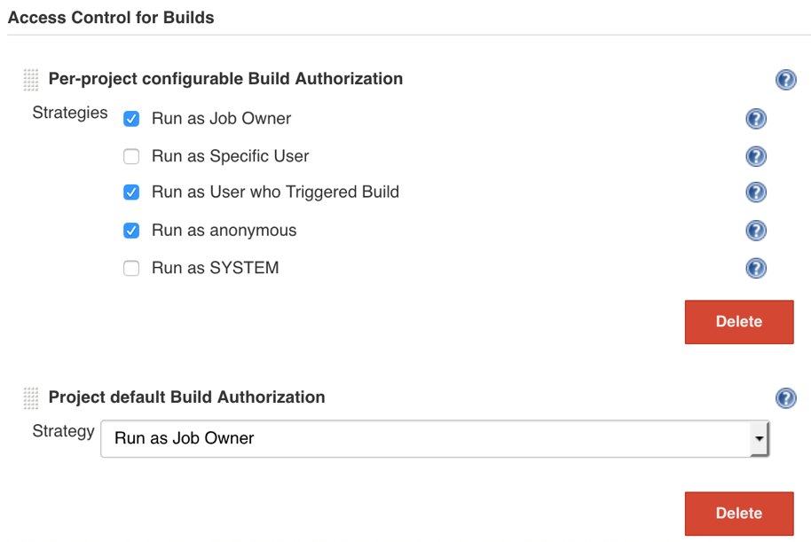

Ownership-Based Security
====

Ownership plugin is heavily focused on the security aspects of Jenkins.
For such purpose the plugin is integrated with many security-related plugins,
which effectively create an "Ownership-based" security ecosystem in Jenkins.

This page describes the available integrations with the following plugins:

* [Role-Based Authorization Strategy](https://plugins.jenkins.io/role-strategy)
* [Job Restrictions](https://plugins.jenkins.io/job-restrictions)
* [Authorize Project](https://plugins.jenkins.io/authorize-project)

## Role-Based strategy integration

Although it does not offer a special Authorization Strategy, 
it offers a deep integration with the [Role-Strategy Plugin](https://wiki.jenkins-ci.org/display/JENKINS/Role+Strategy+Plugin) via the macro engine.

This macro engine greatly reduces the complexity of the configuration and also greatly improves its performance by avoiding massive regular expression checks for multiple roles.

The documentation below provides details regarding the configuration approach.

### Global Roles

In global roles for almost any instance you have to define the roles for Jenkins administrators and other authenticated users.

Performance notes: Having a globally enabled role for a user greatly improves Role Strategy performance, 
  so it is recommended to do so unless there are any security implications on your instance.
On the screenshot below the `authenticated` role has no read access to jobs (`Job.Read`).

### Item and Node roles

The most of the security management goes through the Item and Role nodes. 
There are `@CurrentUserIsOwner` and `CurrentUserIsPrimaryOwner` macros, which are defined in the Role name.

The example below provides a sample configuration, where primary owners have a full access to the job.
Secondary owners are being managed by the `@CurrentUserIsOwner` macro, and they get less permissions.
Note that the primary owners are eligible to assign secondary owners and transfer ownership on their own, hence there is no need in involving Jenkins admins for such local changes.

In the case of advanced setups you can create multiple role macros with different patterns by using an ID parameter, e.g. `@CurrentUserIsOwner(1)` and then `CurrentUserIsOwner(2)` with different regular expressions.

### Role Assignments

For Ownership-Based Strategy Role Assignments just contain mapping of `admin` and `authenticated roles`.
In order to specify all time- and node- specific permissions, 
  in this setup you just need to specify a single role assignment.

### Item-Specific Permissions

:exclamation: This is an advanced feature, which allows going beyond two roles. 
Use with caution.

Item-specific permissions can be configured in the `Manage Ownership` action for jobs.
These permissions may be granted by job owners to particular users (Similar to [Matrix Authorization Strategy](https://plugins.jenkins.io/matrix-auth)).

In order to enable this functionality, use the `@ItemSpecificWithUserID` in item Role definitions.

## Job Restrictions

### Restricting executions on agents

### Restricting execution on the master

It is a common use-case to restrict job runs on the master for security reasons. Script build steps in on-master builds may get access to Jenkins system files with the Jenkins user account, hence there is a risk of data corruption in the case of errornous or malicious scripts. 
On the other hand, it may be a valid case for the backend jobs being owned by admins.

:exclamation: The example below restricts all executions.
Particular job types (e.g. Pipeline) may require executions of particular tasks on the master.
For this purpose you can use Class Restrictions in the plugin.

## Authorize Project Plugin

[Authorize Project Plugin](TODO) allows managing authentication for running builds.
It is pretty important from the Ownership-Based Security strategy point of view, because it allows preventing
interaction with jobs if the owner has no access to the job.

For this purpose Ownership plugin offers the `Run as Job Owner` Authorize strategy, which can be enabled 
globally or for a particular job.

:exclamation: Please note that not all plugins are properly integrated with the `QueueItemAuthenticator` extension point,
which is being used in Authorize Project.

